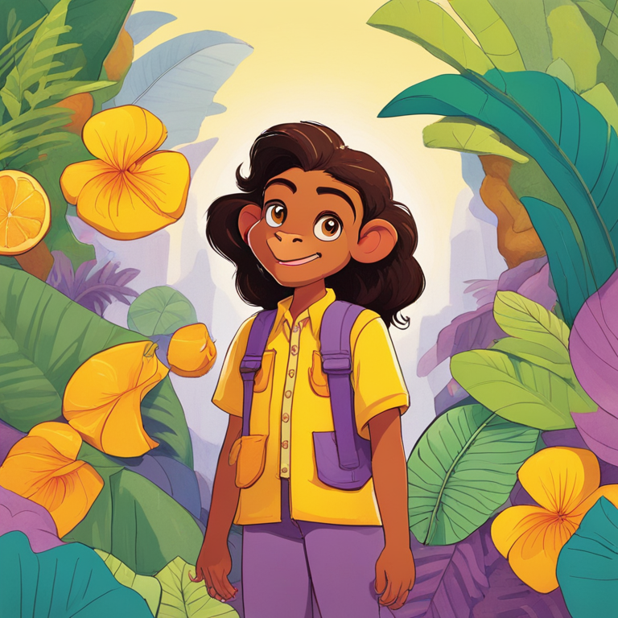

# Story Pallet: AI-Powered Language Learning Coloring Book

Story Pallet is an interactive AI-powered language learning platform that generates personalized children's storybooks and engaging video conversations for language immersion.

## 🌟 Features

### 1. Dynamic Story Generation
- Creates custom children's stories tailored to the child's name and interests
- Generates professionally illustrated scenes for each story segment
- Supports multiple languages including English, Spanish, and French

### 2. Interactive Coloring Book
- Transforms story illustrations into coloring book pages
- Provides both colored and outline versions of each scene
- Offers side-by-side story text and illustrations

### 3. AI Language Tutor
- Creates video conversations with AI characters from the story
- Enables real-time speaking practice with instant feedback
- Allows children to practice pronunciation and comprehension

## 📸 Screenshots

### Story Generation & Illustrations


### Coloring Pages


### Multiple Scene Generation


## 🛠️ Technology Stack

- **Frontend**: Streamlit for the interactive web interface
- **AI Story Generation**: Claude 3.7 Sonnet (Replicate API)
- **Image Generation**: 
  - SDXL for base image creation
  - Stable Diffusion img2img for consistent character appearance
- **Interactive Conversations**: Tavus API for AI video generation
- **Language Processing**: Specialized prompts for child-friendly content

## 🚀 Getting Started

### Prerequisites
- Python 3.8+
- Replicate API key
- Tavus API credentials

### Installation

1. Clone the repository
```bash
git clone https://github.com/yourusername/lingua-story.git
cd lingua-story
```

2. Install dependencies
```bash
pip install -r requirements.txt
```

3. Set up environment variables
```bash
# Create a .env file with your API keys
echo "REPLICATE_API_TOKEN=your_replicate_api_key" > .env
echo "TAVUS_API_KEY=your_tavus_api_key" >> .env
```

4. Run the application
```bash
streamlit run app.py
```

## 📖 How to Use

### Creating a Storybook

1. Go to the "Create Book" tab
2. Enter the child's name and select preferences
3. Choose the target language and style
4. Click "Generate Book" to create a personalized story
5. View the generated story with illustrations and coloring pages

### Interactive Language Practice

1. Navigate to the "Talk with the Character" tab
2. If you've generated a story, it will use those characters
3. Otherwise, configure a new character and language
4. Click "Create Conversation" to initiate an AI video conversation
5. Practice speaking with the AI character who responds and provides feedback

## 🤝 Contributing

Contributions are welcome! Please feel free to submit a Pull Request.

## 📄 License

This project is licensed under the MIT License - see the LICENSE file for details.

## 🙏 Acknowledgements

- [Replicate](https://replicate.com/) for AI model hosting
- [Tavus](https://tavus.io/) for conversational AI video generation
- [Streamlit](https://streamlit.io/) for the interactive web interface
- All contributors who have helped shape this project